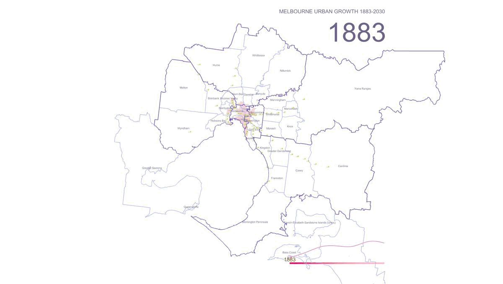
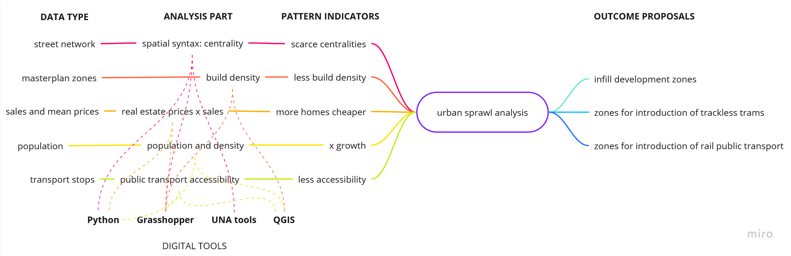

# Remote urban sensing of urban sprawl in Melbourne
## Remote sensing of the urban sprawl’s pace of the Greater Melbourne 
[BLog link](https://blog.iaac.net/remote-sensing-of-the-urban-sprawls-pace-of-melbourne/) 
Urban sensing project in Python  
tools: Jupyter Notebook, R, Python, Pandas +  Geopandas +  Numpy +  Folium + BeautifulSoup + OSMNX + Matplotlib + Plotly + Networkx + Scikit-learn, QGIS, Grasshopper, Urbano.
## What I learned: 
- Data mining and aggregaion from Australian national, state and local resources
- Modelling of dynamic maps in QGIS and Grasshopper
- Data manipulation, cleaning and preparation for analysis
- ETL establishment
- Data visualization
- Map generation and processing with Python, R, QGIS
- Prediction of urban sprawl, lack of social infrastructure

## Statement and questions
Australian cities including Melbourne  are car dependent and this means that housing for a growing population is accommodated largely through a suburban growth model that contributes towards urban sprawl. New suburbs on the fringe of the Victoria’s capital are expensive to build and are heavily subsidized. Average new suburb costs 3 times more than a densified urban neighborhood with the same amount of new residents. While new land-owner pays only for a plot and expansion of utilities, authorities cover expenses for highways, public transport, critical and social infrastructure, environment conservation.

According to Sergio Famiano, author of New Australian Dream: rethinking our homes and cities to solve the housing crisis, population growth and car dependency are the primary drivers of unbridled urban expansion but political will and innovation could still minimize the scale and impact of sprawl in the future. 

If larger urban populations can be accommodated in existing urban areas through infill development, this will limit the establishment of new suburbs and sprawl while at the same time accommodating a greater population.

But there needs to be a policy shift by all levels of government in favour of urban infill development over new suburban development and this needs to be supported by the necessary infrastructure to encourage infill development, such as public transport.There is a strong nexus between mid-tier public transport such as light rail and trackless tram technology and the development of housing diversity such as apartment development.Summing up the main question is: how can we track the pace of urban sprawl of the Melbourne metropolitan area in order to understand what localities could become the first target for infill densified development and improvement of public transportation?

1. Although accurate definition of urban sprawl is debated, a general consensus is that urban sprawl is characterized by unplanned and uneven pattern of growth, driven by multitude of processes and leading to inefficient resource utilization.
2.  Considering the last studies of Melbourne’s urban sprawl revealing the out-breaking population dynamic growth in the fringe zones we are going to prove that the infill densified development should be addressed the first of all to the inner ring of metropolitan zones in order to balance back the urbanization loads. 
3. Additionally, comprehending the dynamics of public transport development, we are going to highlight that the inner ring zones need more public transport connectivity (trackless tram) as a supplement of the strategy of the infill densified development. 

## Data visualization and analysis
### Dynamic map of urban sprawl pace in the Greater Melbourne

### ETL scheme

### Dynamic map of population density by SA2 of Melbourne metropolitan area in 2001-2022  
[SA2 - is a statistic area level 2 in Australia that combines a neighborhood or city district level](https://www.abs.gov.au/statistics/standards/australian-statistical-geography-standard-asgs-edition-3/jul2021-jun2026/main-structure-and-greater-capital-city-statistical-areas/statistical-area-level-2)  

### Mean price of homes by LGA of Melbourne metropolitan area in 1992-2022  
[LGA - is a statistical term defining the Local Government Area,  equal to a territory of municipality or a shire in Australia.](https://www.abs.gov.au/statistics/standards/australian-statistical-geography-standard-asgs-edition-3/jul2021-jun2026/non-abs-structures/local-government-areas)  

## Key takeaways
- Urban Density correlates with the flats (apartments) market while homes construction booms on the remote perimeter of the metropolitan area.
- The most actively population grows in North,West and South East remote localities fueled by low-rise development.
- 400-m catchment area of public transport has gaps in the localities with fast growing population.
- Infill development would be reasonable within the inner perimeter of metropolitan area on the edge of well developed area of public transport.

## Refernces
- The New Australian Dream: Rethinking Our Homes and Cities to Solve the Housing Crisis. 2022. Sergio Famiano. [Aurora House](https://aurorahouse.com.au/product/how-to-buy-your-own-home-in-australia/)
- Analysis of Urban Growth and Sprawl from Remote Sensing Data. 2010. Springer. Dr. Basudeb Bhatta. DOI [10.1007/978-3-642-05299-6](https://doi.org/10.1007/978-3-642-05299-6).
- Monitoring Urban Sprawl Using Time-Series Data: Famagusta Region of Northern Cyprus. 2021. Sage Journals. Kamyar Fuladlu, Müge Riza, Mustafa Ilkan. [SAGE Journals](https://doi.org/10.1177/21582440211007465)
- How is Melbourne’s population density changing? (2006-2016). Article in Charting Transport journal, 2017. [Charting Transport](https://chartingtransport.com/2017/07/09/how-is-melbournes-population-density-changing-2006-2016/)
- Urban Calculator toolset by the Spatial Morphology Group from Chalmers Institute of Technology. [SMoG](https://www.smog.chalmers.se/urbancalculator)
- [Department of Industry, Science, Energy and Resources - DISR](https://researchdata.edu.au/department-industry-science-resources-disr/1433377)
- [Australian Statistical Geography Standard (ASGS) Edition 3, Jul 2021 - Jun 2026 - ABS](https://www.abs.gov.au/statistics/standards/australian-statistical-geography-standard-asgs-edition-3/jul2021-jun2026/access-and-downloads/digital-boundary-files)
- [Melbourne Housing Data - Kaggle (GitHub)](https://github.com/dipalira/Melbourne-Housing-Data-Kaggle)
- [Data.Vic - Discover](https://discover.data.vic.gov.au)
- [Department of Transport Planning - Victoria](https://dtp.vic.gov.au/)
- [DataShare - Maps Victoria](https://datashare.maps.vic.gov.au)
- [University of Melbourne Library Guide](https://unimelb.libguides.com/c.php?g=402981&p=6741862)
- [Land Victoria - How to Access Spatial Data](https://www.land.vic.gov.au/maps-and-spatial/spatial-data/how-to-access-spatial-data)
- [Plan Melbourne Maps](https://planmelbourne.vic.gov.au/maps)
- [How to Buy Your Own Home in Australia - Aurora House](https://aurorahouse.com.au/product/how-to-buy-your-own-home-in-australia/)
- [Analysis of Urban Growth and Sprawl (PDF)](http://www.stellenboschheritage.co.za/wp-content/uploads/Analysis-of-Urban-Growth-and-Sprawl.pdf)
- [Monitoring Urban Sprawl Using Time-Series Data - Sage Journals](https://journals.sagepub.com/doi/full/10.1177/21582440211007465)
- [How is Melbourne’s Population Density Changing? (2006-2016) - Charting Transport](https://chartingtransport.com/2017/07/09/how-is-melbournes-population-density-changing-2006-2016/)
- [Urban Calculator Toolset - SMoG](https://www.smog.chalmers.se/urbancalculator)
- [UNA Rhino Toolbox - CityForm MIT](https://cityform.mit.edu/projects/una-rhino-toolbox)
